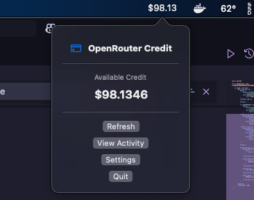
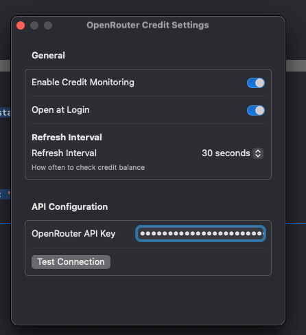

# OpenRouterCreditMenuBar

A sleek macOS menu bar application for monitoring your OpenRouter API credits in real-time.





## Features

- **Real-time Credit Monitoring**: Display your OpenRouter credit balance directly in the menu bar
- **Automatic Refresh**: Configurable refresh intervals (30 seconds default)
- **Clean Interface**: Minimalist menu bar design that shows your available credit at a glance
- **Secure Configuration**: Encrypted API key storage with connection testing
- **Launch at Login**: Optional automatic startup when you log in
- **Settings Panel**: Easy-to-use configuration window

## Screenshots

### Menu Bar Display
The app shows your current available credit ($98.1809 in the example) directly in a dropdown menu.

### Settings Window
- Toggle credit monitoring on/off
- Set launch at login preferences  
- Configure refresh intervals
- Securely enter and test your OpenRouter API key


## Requirements

- macOS 15.4 or later
- OpenRouter API account and API key
- Xcode 16.3 or later (for development)

## Installation

### From Release
1. Download the latest release from the [Releases](../../releases) page
2. Extract the .zip file
3. Move the application to your Applications folder
4. Launch the app and grant necessary permissions when prompted

### From Source
1. Clone this repository:
   ```bash
   git clone https://github.com/yourusername/OpenRouterCreditMenuBar.git
   ```
2. Open `OpenRouterCreditMenuBar.xcodeproj` in Xcode
3. Build and run the project (⌘+R)

## Setup & Configuration

1. **Get Your API Key**: 
   - Visit [OpenRouter](https://openrouter.ai) and create an account
   - Navigate to your API keys section
   - Generate a new API key

2. **Configure the App**:
   - Launch OpenRouterCreditMenuBar
   - Click the menu bar icon and select "Settings"
   - Enter your OpenRouter API key in the "API Configuration" section
   - Click "Test Connection" to verify your API key works
   - Adjust refresh interval as needed (default: 30 seconds)
   - Optionally enable "Open at Login" for automatic startup

3. **Start Monitoring**:
   - Enable "Credit Monitoring" in settings
   - Your credit balance will appear in the menu bar
   - Click "Refresh" anytime to update manually

## Usage

- **View Credits**: Click the menu bar icon to see your current available credit
- **Refresh**: Use the "Refresh" button to manually update your balance
- **Settings**: Access configuration options through the Settings button
- **Quit**: Close the application using the Quit button

The menu bar will display your credit balance and update automatically based on your configured refresh interval.

## Development

This project is built with:
- **Language**: Swift
- **Platform**: macOS 15.4+
- **IDE**: Xcode 16.3+
- **Architecture**: Native macOS menu bar application

### Building from Source

1. Clone the repository
2. Open `OpenRouterCreditMenuBar.xcodeproj` in Xcode
3. Configure signing & capabilities if needed
4. Build using ⌘+B or run with ⌘+R

### Project Structure
- Menu bar integration with real-time updates
- Secure keychain storage for API credentials
- Native macOS UI with dark mode support
- Sandboxed application architecture

## Security & Permissions

This app requires the following permissions:
- **Network Access**: To communicate with OpenRouter's API endpoints
- **Keychain Access**: To securely store your API key (optional)
- **Launch Agent**: To start automatically at login (if enabled)

The application runs in a sandboxed environment for enhanced security.

## Privacy

- Your API key is stored locally and never transmitted except to OpenRouter's official API
- No usage data or personal information is collected
- All network requests go directly to OpenRouter's servers

## Contributing

Contributions are welcome! Please feel free to submit a Pull Request.

1. Fork the repository
2. Create your feature branch (`git checkout -b feature/amazing-feature`)
3. Commit your changes (`git commit -m 'Add some amazing feature'`)
4. Push to the branch (`git push origin feature/amazing-feature`)
5. Open a Pull Request

## License

[Add your chosen license here - e.g., MIT, Apache 2.0]

## Support

If you encounter any issues or have questions:
- [Open an issue](../../issues) on GitHub
- Check existing issues for common solutions

## Roadmap

- [ ] Credit usage history and analytics
- [ ] Multiple account support
- [ ] Custom notification thresholds
- [ ] Export credit usage data

---

**Note**: This application is not officially affiliated with OpenRouter. It's a community-developed tool for monitoring API credits.